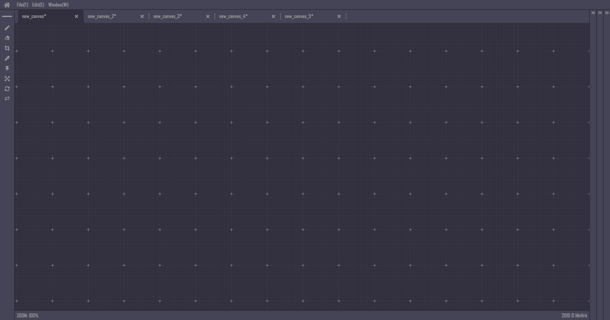

# <p align="middle"><font color="#c1125b">C</font>ANVAS EVE</p>

<p align="middle">CANVAS EVE is a daily-use canvas which will be helpful in various ways :
<br>references, memos, image previews, etc.
<br><a href="https://nkihrk.github.io/CANVAS-EVE/"><b>DEMO</b></a>
</p>



> Heads Up : This project is currently under development. It won`t be stable for now.

<br>

# 💡 Current Features

- **Drag'n'Drop** single or multiple files on the app
  - Supported file formats :
    - jpg/png/gif/svg/bmp/psd
    - obj(mtl)/fbx/gltf(bin)/vrm/pmx/pmd
- **Paste** a single file to the app
  - Supported file formats : jpg/png/gif/svg/bmp/psd
- **Play YouTube** on the app with browser-like-window
- **Color Picker** for images
- **Pen/Eraser** for drawing
- **Zoom In/Out** with mousewheel rotation
- **Move** around the canvas with mousewheel
- **Resize/Pinned/Rotate/Flip** files on the canvas
- **Single/Multiple Selection** on the canvas
- **Auto-Aligment** for files with `Ctrl + Arrow key`
- **Photoshop-like UI**
- **Right-Click Context Menu**

<br>

# ⛏️ How To Build

```
$ cd CANVAS-EVE/
$ npm install
$ npm run build
```

Use Webpack's web-dev-server to host a local server( `http://localhost:8080/` )

```
$ npm run start_win // For windows user
$ npm run start_linux // For linux user
```

<br>

# 📝 Future Release Notes

Last updated : November 11, 2019

- Make the app cross-browser and cross-platform. Will be launched as both a web service and native apps.
- Switching tool-tabs with a click
- Moving tools to other sidebars
- Link Pinterest with the app to get images from user`s boards

<br>

# 💪 Currently Working On...

Last updated : November 11, 2019

- Photoshop-like UI. This will be finished in the near future.
- Invoke YouTube window from right-click context menu
- Make tools on the left-sidebar work properly

<br>

# ⚙️ How To Use

Currently working on it.

<br>

# 🦟 Bug Report

If you find bugs, please report to me opening new issues on GitHub.
